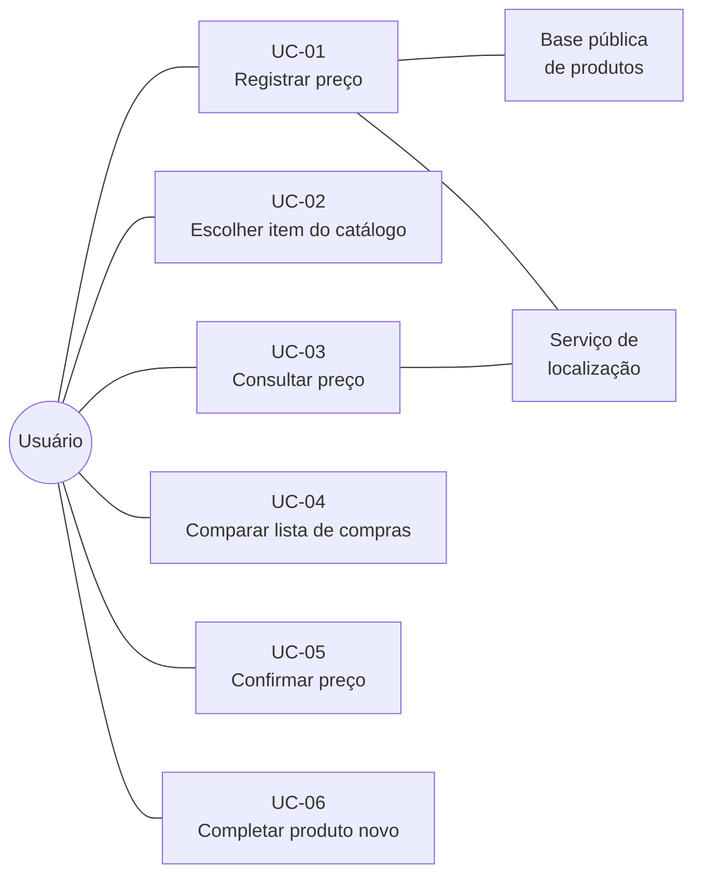

# Casos de Uso — Bom Preço

Modelagem conceitual do comportamento, cobrindo os requisitos do MVP. Formato breve: sem
diagrama formal e sem fluxos alternativos exaustivos.

Vocabulário e entidades vêm do [modelo de domínio](modelo-de-dominio.md).

## Atores

| Ator | Descrição |
| ---- | --------- |
| **Usuário** | Pessoa com sessão ativa, anônima ou vinculada. Alterna entre contribuir e consultar, conforme o momento |
| **Base pública de produtos** | Sistema externo consultado por GTIN para obter nome, marca e quantidade |
| **Serviço de localização** | Fornece as coordenadas do dispositivo |

---

## UC-01 — Registrar preço de um produto

**Requisitos:** RF-02, RF-03, RF-06, RF-07, RF-08, RF-11, RF-41 · **RNF:** RNF-05, RNF-06

| | |
| --- | --- |
| **Ator** | Usuário |
| **Pré-condição** | Sessão ativa, anônima ou vinculada, dentro ou próximo de um mercado |
| **Pós-condição** | Um registro de preço imutável existe para a tripla produto-mercado-instante |

**Fluxo principal**

1. Usuário aciona o registro de preço
2. Sistema obtém as coordenadas e sugere o mercado mais próximo
3. Usuário confirma o mercado sugerido
4. Usuário aponta a câmera para o código de barras
5. Sistema lê o GTIN e consulta a base pública de produtos
6. Sistema exibe nome, marca e quantidade do produto encontrado
7. Usuário digita o valor observado
8. Usuário indica se é preço normal ou promoção (RF-11)
9. Sistema grava o registro de preço, marcando se a localização coincidia com o mercado
   escolhido (RF-41). A coordenada em si é descartada (RD-13)

**Variações**

| Situação | Tratamento |
| --- | --- |
| Mercado sugerido está errado | Usuário escolhe outro da lista (RF-07). Mercado novo é cadastrado pelo mantenedor, nunca pelo usuário (RD-10) |
| GTIN não encontrado na base pública | Segue para UC-06, preenchendo os dados do produto |
| Produto sem código de barras | Segue para UC-02, escolhendo o item no catálogo |
| Localização não coincide com o mercado escolhido, ou o GPS não fixa | Registro é gravado normalmente, apenas sem a marca de conferido no local. Nunca bloqueia — dentro do prédio o erro de GPS chega a dezenas de metros (RF-41) |
| Sem conectividade | Registro entra na fila local e é reenviado quando a conexão voltar (RNF-06). O usuário é informado de que está pendente |
| Já existe registro do mesmo usuário para este produto e mercado hoje | Sistema grava um registro novo. O anterior fica superado e sai do histórico exibido — nada é editado nem apagado (RD-02, RD-04) |

---

## UC-02 — Escolher item sem código de barras

**Requisitos:** RF-04, RF-05, RF-32 · **Regra:** RD-08

| | |
| --- | --- |
| **Ator** | Usuário |
| **Pré-condição** | Produto não possui código de barras: hortifruti, açougue, padaria, granel |
| **Pós-condição** | Um item do catálogo está selecionado para receber o preço |

**Fluxo principal**

1. Usuário informa o que está comprando
2. Sistema busca no catálogo curado e exibe os itens correspondentes
3. Usuário seleciona o item
4. Sistema retorna ao UC-01 com o item selecionado

**Variações**

| Situação | Tratamento |
| --- | --- |
| Item não está no catálogo | Usuário pede a inclusão. No MVP isso acontece fora do aplicativo, por mensagem ao mantenedor (RF-32) |
| Item vendido a granel | O item do catálogo já traz a unidade de medida; o preço registrado é o preço por quilo |

> O catálogo é montado pelo autor antes do lançamento, com os itens sem código de barras
> encontrados nos mercados de Goianésia. É essa restrição que derruba o R3 de probabilidade
> alta para baixa: sem criação livre, não existe duplicata a resolver depois.

---

## UC-03 — Consultar o preço de um produto

**Requisitos:** RF-12, RF-13, RF-14, RF-15, RF-16 · **RNF:** RNF-09, RNF-12

| | |
| --- | --- |
| **Ator** | Usuário |
| **Pré-condição** | Usuário autenticado |
| **Pós-condição** | Nenhuma. Consulta não altera estado |

**Fluxo principal**

1. Usuário busca um produto por nome ou por leitura do código de barras
2. Sistema obtém as coordenadas do usuário
3. Sistema reúne o preço mais recente de cada mercado próximo, descartando os de mais de 30 dias
4. Sistema exibe a lista ordenada por preço, com a idade de cada um e o preço por unidade
5. Usuário abre um mercado da lista e vê o histórico daquele produto ali

**Variações**

| Situação | Tratamento |
| --- | --- |
| Nenhum preço válido | Sistema informa a ausência e convida a registrar o primeiro |
| Só existem preços com mais de 30 dias | Sistema os exibe marcados como desatualizados, mediante escolha do usuário |
| Produtos de tamanhos diferentes na mesma tela | Comparação se dá pelo preço por unidade normalizado (RD-05, RD-06) |

---

## UC-04 — Comparar a lista de compras entre mercados

**Requisitos:** RF-20, RF-21

| | |
| --- | --- |
| **Ator** | Usuário |
| **Pré-condição** | Usuário autenticado |
| **Pós-condição** | Lista persistida com a indicação de mercado por item |

**Fluxo principal**

1. Usuário cria uma lista e adiciona produtos com as quantidades desejadas
2. Sistema busca, para cada item, o menor preço válido entre os mercados próximos
3. Sistema exibe cada item com o mercado mais barato e o valor correspondente
4. Usuário usa a lista durante a compra

**Variações**

| Situação | Tratamento |
| --- | --- |
| Item sem nenhum preço válido | Item aparece na lista marcado como sem preço conhecido |
| Menor preço está em mercado distante | Fora do escopo do MVP: distância não entra no cálculo (decisão registrada na Visão) |

---

## UC-05 — Confirmar um preço existente

**Requisitos:** RF-24, RF-25 · **Regra:** RD-03

| | |
| --- | --- |
| **Ator** | Usuário |
| **Pré-condição** | Existe registro de preço para o produto naquele mercado |
| **Pós-condição** | Uma confirmação é gravada e a idade efetiva do preço é zerada |

**Fluxo principal**

1. Usuário vê um preço na consulta e reconhece que confere com a prateleira
2. Usuário aciona a confirmação
3. Sistema grava a confirmação vinculada ao registro e ao usuário
4. Sistema passa a calcular a idade a partir desta confirmação

**Variações**

| Situação | Tratamento |
| --- | --- |
| Usuário é o autor do registro | Confirmação é aceita e renova a idade, mas fica marcada como auto-confirmação e vale menos que a de terceiro (RD-03). Sem isso, com poucos usuários nada seria confirmado e a base envelheceria por inteiro |
| Preço observado difere do registrado | Usuário registra novo preço via UC-01 em vez de confirmar |

---

## UC-06 — Completar produto com código de barras desconhecido

**Requisitos:** RF-33 · **Regra:** RD-09

| | |
| --- | --- |
| **Ator** | Usuário |
| **Pré-condição** | O GTIN foi lido, mas a base pública não retornou nenhum produto |
| **Pós-condição** | Produto criado e vinculado àquele GTIN |

**Fluxo principal**

1. Sistema informa que não encontrou o produto e exibe o GTIN lido
2. Usuário informa nome, marca, quantidade e unidade de medida
3. Sistema cria o produto vinculado ao GTIN
4. Sistema retorna ao UC-01

**Variações**

| Situação | Tratamento |
| --- | --- |
| O GTIN já existe na base do app, cadastrado por outra pessoa | Sistema usa o produto existente. Não há criação nem duplicata: o código de barras é a chave (RD-09) |
| Usuário desiste de preencher | Nenhum produto é criado e o preço não é registrado |

> Diferente do UC-02, aqui a criação pelo usuário é permitida — e não gera duplicata,
> porque o GTIN garante a identidade. O risco do R3 existe apenas onde não há código.

---

## Fora dos casos de uso

**Entrar no app** (RF-01, RF-37) não tem fluxo porque não tem passos: na primeira abertura
o sistema cria uma sessão anônima com apelido gerado, e a pessoa já pode usar. Nada é
pedido.

**Instalar na tela inicial** (RF-39) e **vincular identidade** (RF-38) são convites
oportunos, não casos de uso: o primeiro aparece cedo, porque no iOS é o que impede o
navegador de apagar a sessão; o segundo, depois de alguns registros, quando a pessoa já tem
algo a perder ao trocar de aparelho. Vincular preserva o mesmo usuário e todos os seus
registros.

Os demais requisitos funcionais estão fora do MVP e ganharão caso de uso quando forem
priorizados.
