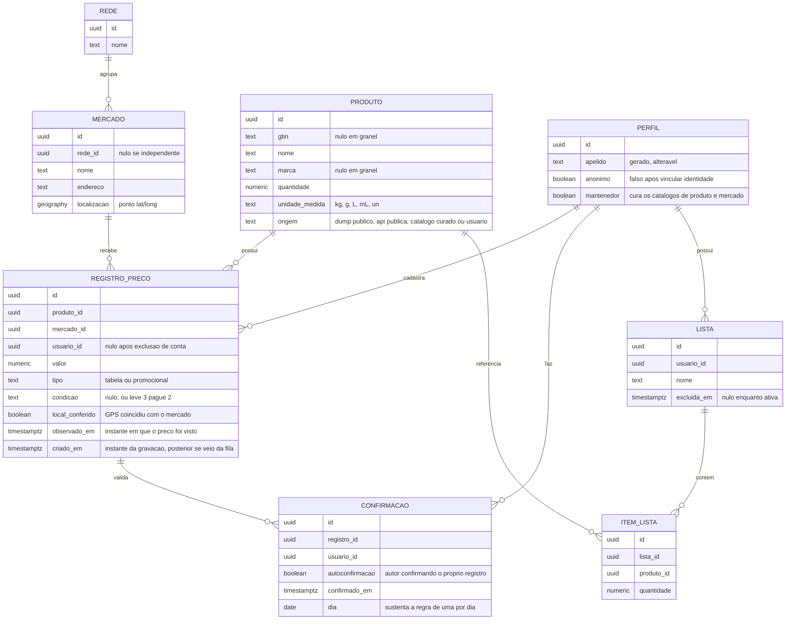

# Modelo de Domínio e Glossário — Bom Preço

Modelagem conceitual do domínio. É o artefato que fixa o vocabulário e a identidade das
entidades — e, na prática, o rascunho do esquema do banco.

## Glossário

| Termo | Definição |
| ----- | --------- |
| **Rede** | Marca comercial que agrupa lojas sob o mesmo nome. Não tem preço próprio |
| **Mercado** | Loja física, com endereço e coordenadas. É a unidade que tem preço. Pode ou não pertencer a uma rede |
| **Produto** | Item comercializável concreto, com marca e quantidade definidas. "Arroz Tio João Tipo 1 5 kg" é um produto; a versão de 1 kg é outro |
| **GTIN** | Número do código de barras. Quando existe, é a identidade do produto. Ausente em granel, hortifruti e açougue |
| **Registro de preço** | Observação de um preço: um produto, num mercado, num instante, feita por um usuário. Nunca é alterado nem apagado |
| **Confirmação** | Ato de um usuário atestar que um registro de preço continua válido, sem criar registro novo. Confirmação de terceiro vale mais que a do próprio autor, e as duas são distinguidas (RD-03) |
| **Preço por unidade** | Valor dividido pela quantidade, normalizado (R$/kg, R$/L, R$/un). Base de comparação entre embalagens diferentes |
| **Preço de tabela** | Preço normal de prateleira |
| **Preço promocional** | Preço com desconto, possivelmente condicionado a quantidade ("leve 3 pague 2") ou a app do mercado |
| ***Shrinkflation*** | Redução da quantidade da embalagem sem redução proporcional do preço |
| **Idade do preço** | Tempo desde a última observação ou confirmação. Determina o quanto se pode confiar nele |
| **Conferido no local** | Marca de que a localização do aparelho coincidia com o mercado no momento do registro. É sinal de confiança, nunca condição para registrar |
| **Conta anônima** | Perfil criado na primeira abertura, sem cadastro, com apelido gerado. Pode ser vinculado depois a Google ou e-mail, mantendo o mesmo identificador e todos os registros |
| **Perfil** | O que o sistema guarda sobre uma pessoa: apelido e estado da conta. A autenticação em si vive fora, no serviço de identidade — por isso a entidade não se chama "usuário" |
| **Mantenedor** | Perfil com permissão para curar os catálogos de mercado e de produto. Hoje é só o autor |

## Diagrama

## Decisões de modelagem

Quatro perguntas que estavam em aberto desde a elicitação, com a decisão e o motivo.

### 1. Mercado é a rede ou a loja?

**É a loja.** Rede é entidade separada e opcional, apenas para exibição e agrupamento.

Duas lojas da mesma rede em Goianésia podem ter preços diferentes, e a geolocalização
identifica uma loja específica, não uma marca. Modelar preço na rede tornaria o dado
errado por construção. `rede_id` é nulo para mercado independente, que é a maioria em
cidade pequena.

Isso encerra o item "diferenciar preços por filial" do brainstorm: ele deixa de ser
funcionalidade e passa a ser consequência do modelo.

**Quem cria mercado.** O mantenedor, e só ele (RD-10). Mercado é metade da chave de um
registro de preço, então duplicá-lo quebra a comparação exatamente como duplicar produto —
dois usuários criando "Supermercado Central" e "Super Central" para a mesma loja produzem
dois conjuntos de preços que nunca se encontram. A defesa é a mesma escolhida para produto
sem GTIN: lista fechada, curada. Em Goianésia são cerca de dez lojas, levantáveis numa
tarde.

Fontes externas não resolvem isso: os termos do Google Maps proíbem armazenar nome e
endereço de lugares, permitindo guardar apenas o `place_id`. O OpenStreetMap permite, mas a
cobertura de cidade do interior é parcial.

### 2. O que identifica um produto?

**O GTIN, quando existe.** Quando não existe, a identidade é a combinação de nome
canônico, marca, quantidade e unidade de medida.

Consequência importante: **embalagens diferentes são produtos diferentes.** Arroz de 1 kg e
de 5 kg têm GTINs distintos e são registros distintos. Não existe entidade "embalagem"
separada — quantidade e unidade são atributos do próprio produto, que é como o GTIN já
funciona no mundo real.

Esta é a decisão que ataca o risco R3. Produto sem código de barras é o caso frágil: dois
usuários cadastrando "tomate" e "Tomate italiano kg" criariam duas entidades e quebrariam a
comparação.

A mitigação escolhida elimina o problema pela raiz: **o usuário não cria produto sem GTIN.**
Hortifruti, açougue, padaria e granel vêm de um catálogo curado pelo autor, e o usuário
apenas escolhe da lista. Item ausente entra por pedido, fora do aplicativo enquanto o
número de usuários for pequeno.

O caso de produto **com** GTIN ausente da base pública é diferente e continua permitindo
preenchimento manual: o código de barras é a chave, então dois usuários preenchendo o mesmo
GTIN chegam ao mesmo produto, sem risco de duplicata.

### 3. O que é um registro de preço?

**Um fato imutável:** produto, mercado, usuário, valor, instante.

Registro nunca é editado nem apagado — corrigir um preço significa criar outro registro
mais recente. É isso que produz o histórico de graça, e o histórico sustenta três itens do
escopo (variação ao longo do tempo, *shrinkflation* e promoção real contra preço inflado).

Confirmação é entidade à parte, não um contador no registro. Assim se sabe quem confirmou e
quando, sem perder a distinção entre "muita gente confirmou uma vez" e "uma pessoa
confirmou muitas vezes".

### 4. Por quanto tempo um preço é válido?

**Nunca expira; envelhece.** Não há remoção automática nem campo booleano de validade.

A idade é derivada de `max(observado_em, última confirmação)` e classificada na exibição:

| Idade | Tratamento |
| ----- | ---------- |
| Até 7 dias | Recente |
| 8 a 30 dias | Antigo, exibido com ressalva |
| Mais de 30 dias | Desatualizado, não entra na comparação por padrão |

Os limites são arbitrários e devem ser ajustados com uso real. O ponto é que a decisão vive
na consulta, não no dado — o que permite mudar de ideia sem migração.

**Por que o autor pode confirmar o próprio registro (RD-03).** A regra original proibia, para
que confirmação significasse validação independente. Mas no lançamento há poucos usuários,
cada um frequentando o mercado perto de casa: a chance de duas pessoas distintas cruzarem no
mesmo produto e mercado dentro de 30 dias é baixa. Com a proibição, nada seria confirmado e
a base inteira envelheceria até sair da comparação.

Permitir a auto-confirmação mantém o dado vivo. O sinal de confiança não se perde porque as
duas são distinguidas: confirmação de terceiro vale mais do que a do próprio autor, e a
interface mostra qual é qual.

Isso responde a "estratégia de confirmação de preço", que estava em aberto desde a primeira
triagem do brainstorm.

## Regras de domínio

| # | Regra |
| - | ----- |
| RD-01 | Preço pertence a um mercado (loja), nunca a uma rede |
| RD-02 | Registro de preço é imutável; correção se faz com registro novo |
| RD-03 | Confirmação do próprio registro é permitida, mas vale menos que a de outro usuário e é exibida como tal |
| RD-04 | Vários registros do mesmo usuário para o mesmo produto e mercado no mesmo dia são permitidos; vale o mais recente, e os superados não entram no histórico exibido |
| RD-05 | Preço por unidade só compara dentro da mesma dimensão: massa com massa, volume com volume, contagem com contagem |
| RD-06 | Massa é normalizada para kg, volume para litro, antes de qualquer comparação |
| RD-07 | Preço promocional não substitui o preço de tabela: são registros distintos e coexistem |
| RD-08 | Produto sem GTIN não é criado pelo usuário: provém de catálogo curado, mantido pelo autor |
| RD-09 | Produto com GTIN ausente da base pública pode ser preenchido pelo usuário, pois o próprio GTIN garante a identidade |
| RD-10 | Mercados são cadastrados pelo mantenedor; o usuário escolhe da lista e não cria |
| RD-11 | Excluir a conta anonimiza a autoria dos registros de preço; os preços permanecem, sem dono |
| RD-12 | Lista de compras apagada pelo dono sai por exclusão lógica; exclusão de conta a remove de fato |
| RD-13 | A coordenada do dispositivo nunca é persistida: dela restam apenas o mercado escolhido e o indicador de conferência |
| RD-14 | Uma confirmação por pessoa, por registro, por dia. Renovar a idade mês a mês é permitido; clicar várias vezes no mesmo dia não conta duas |
| RD-15 | Um produto aparece no máximo uma vez em cada lista de compras; repetir ajusta a quantidade |

## Evolução prevista

Coisas deliberadamente **fora** do modelo agora, com a nota do que custam depois.

> **Sobre *shrinkflation*.** A regra do GS1 exige novo GTIN sempre que o conteúdo líquido
> declarado muda, para mais ou para menos. Logo, encolhimento de embalagem aparece como um
> **produto novo**, não como a quantidade mudando sob o mesmo código — e detectá-lo exige
> ligar o GTIN antigo ao novo, que é o papel do produto genérico. Nada se perde adiando:
> os dois produtos ficam gravados com seus históricos, esperando serem associados.

| Conceito | Quando entra | Custo de adiar |
| -------- | ------------ | -------------- |
| **Produto genérico** — agrupa marcas e tamanhos do mesmo item. Serve para recomendar alternativo mais barato e para detectar *shrinkflation* | Quando qualquer uma das duas funções sair do backlog | Baixo: tabela nova e chave estrangeira anulável em `produto` |
| **Reputação e denúncia** | Se aparecer preço falso | Baixo: derivam de dados que os registros já contêm |
| **Foto da etiqueta** | Se a evidência virar necessária | Baixo: coluna e bucket no storage |

> O único item com custo de adiar alto é o histórico de quantidade. Vale decidir agora se
> *shrinkflation* é objetivo real do produto — está nos objetivos secundários da Visão — ou
> se é ideia solta do brainstorm.
